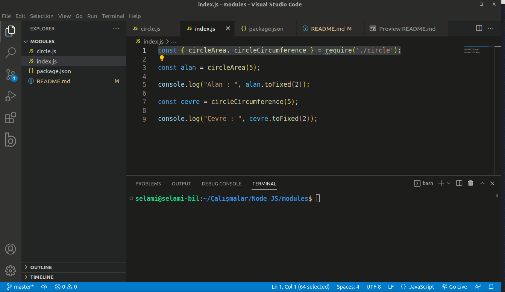

# JavaScript Modül Kavramı

JavaScript kullanırken hazladığımız fonksiyon ve değişkenleri modüller halinde farklı dosyalarda tutabiliriz. Böylece hazırladığımız farklı modülleri dilediğimiz zaman farklı projelerde kullanabiliriz.

Mesela, daire alanını ve çevresini hesapladığımız 2 fonksiyondan oluşan bir circe modülümüz olsun. Bu modül içerisinde iki farklı fonksiyon oluşturuyoruz.



```
const circleArea = (r) => {
    return 3.14 * ( r * r );
}

const circleCircumference = (r) => {
    return 2 * 3.14 * r;
}
```

Bu oluşturduğumuz fonksiyonları ```module.exports``` yadımı ile dışarı aktarıyoruz. Böylelikle bu dosyaya ulaşabilen diğer dosyalardan bu fonksiyonları çağırabileceğiz. Bunun için ```index.js``` dosyası içerisinden bu fonksiyonları çağırıyoruz.

Çağırma işlemi için ```require``` yöntemini kullanıyoruz. Bu yöntem ile farklı dosyalarda hazırladığımız ve dışarı aktardığımız metod ve değişkenleri içeri alabiliriz.

```
const { circleArea, circleCircumference } = require('./circle');

```

Artık içeri aldığımı bu iki fonksiyonu rahatlıkla kullanabiliriz.

```
circleArea(5);

```

